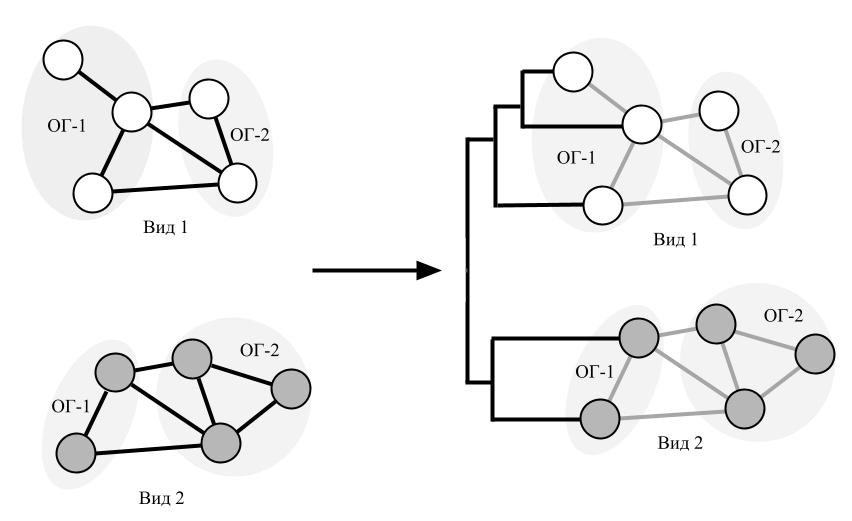
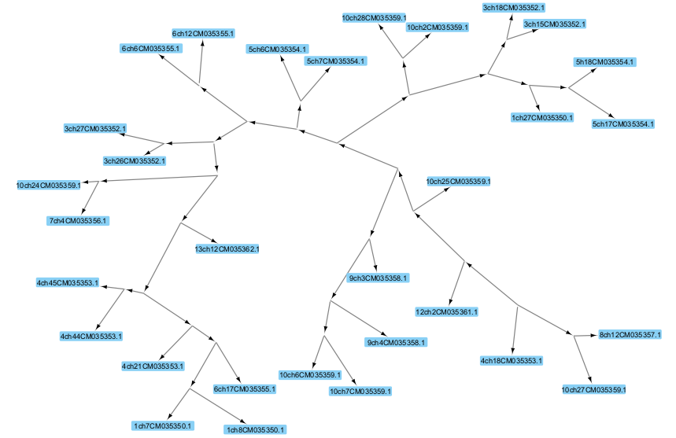
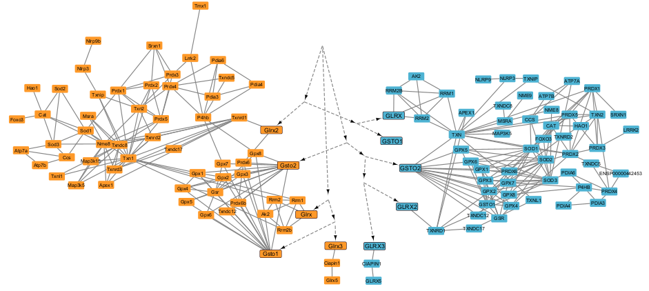

# EvoNet
EvoNet - приложение-расширение для программного обеспечения Cytoscape, предназначенное для интеграции филогенетических деревьев с генными сетями.  

Расширение позволяет использовать среду Cytoscape для работы с филогенетическими деревьями в формате генных сетей, а также, путем интеграции сетей разных видов с деревьями, позволяет получать программное и визуальное представление данных, объединяющее информацию о взаимодействии генов с информацией об их эволюции. 

Работа была выполнена в рамках проекта РНФ № 23-24-00536, посвященного изучению эволюции клеточных типов врожденного иммунитета.

## Установка
Для использования программного обеспечения, необходимо скачать архив EvoNet-x.x.jar и установить его в среде Cytoscape, выбрав файл с помощью меню **Apps -> App Store -> Install Apps From File**. После выбора файла EvoNet-x.x.jar в появившемся окне, расширение будет установлено и появится в соответствующем меню расширений. 

## Запуск
Для применения описанного подхода к интеграции данных с использованием расширения следует выполнить следующие шаги:
1. Открыть генные сети, подлежащие эволюционному анализу в программе Cytoscape.
2. Подготовить файл в формате Newick, содержащий эволюционное дерево / деревья с генами интереса.
3. Выбрать пункт **Apps -> Create network from nwk tree** для загрузки деревьев.
4. Осуществить объединение сетей путем выбора пункта **Tools -> Merge -> Networks...**

## Результат выполнения программы
- Пример импортированного эволюционного дерева:

- Пример интеграции дерева и генных сетей двух видов

